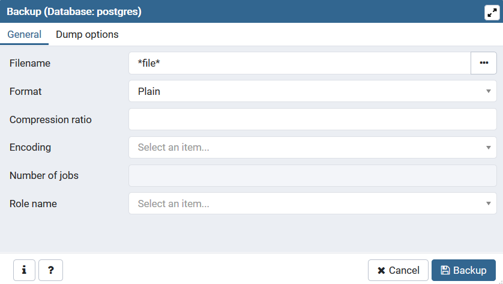
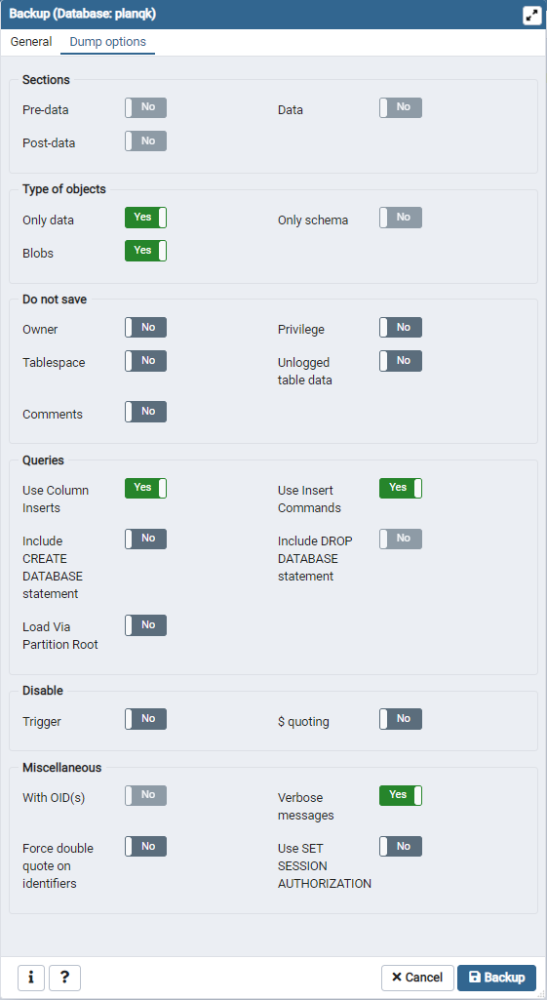

# planqk-atlas-content

### Add example data to the data base in the right order:

Before adding a **qpu**:
  * add related *provider*
  * add related *sdk*
  
Before adding an **implementation**:
  * add related *algorithm*
  * add related *sdk*
  
**Hint:** *Required IDs of the related entities in the JSONs are marked with* "..." *and must be set accordingly.*

## Creating a new Data Set with PgAdmin
[PgAdmin](https://www.pgadmin.org/) can be used to inspect and backup postgres database. With the following steps, a backup .sql file can be created: 

- Download [PgAdmin 4](https://www.pgadmin.org/download/)
- Start PgAdmin, the application should open on a browser: http://127.0.0.1:61014/browser/
- Specifiy a master password
- Make sure that your postgres database is running
- Click "Object">"Create">"Server" to connect to your database 

    - General: Enter e.g. "PlanQk Atlas postgres database" as Name
    - Connection for a local database: Host name address: localhost, Port: 5432, username: postgres, maintenance database: postgres (if you run the database in docker, these properties should match the docker(-compose) file definition)

- Make sure you have inserted the data that you want to backup into the database
- "Refresh" the database (right-click on your database instance (e.g. "PlanQk Atlas postgres database"))
- Choose "Backup..." (right-click on postgres, which is located at "PlanQk Atlas postgres database" > Databases (1) > postgres
In general, we store the schema separately from the data because this allows pgAdmin to preserve the insertion dependencies between tables. 
If the schema changed, you should backup a new version of the schema as well. 

    - First select the appropriate file (schema or data) and chose "Plain" in the "Format" row

    - To back up the schema, choose the following setup: 

    - To back up the data, choose the following setup: 

 - Rename the files such that schema files starts with "0_" and the data file starts with "1_" (this alphabetical ordering is needed so the schema file is loaded first)
 - Replace both files in the [planqk-atlas-content repository](https://github.com/PlanQK/planqk-atlas-content) located under planqk-atlas-content/example-data/SQL/backup-files/
  
